# 📱 UAS Pemrograman Mobile Lanjutan

## Identitas Pengembang

- **Nama:** Yehezkiel Arisandi Bulan
- **NIM:** 1125170084
- **Kelas:** KS 25
- **Program Studi:** Teknik Informatasi
- **Konsentrasi:** Software Engineering

---

## 🛒 Aplikasi E-Commerce Katalog Laptop

Aplikasi ini dikembangkan sebagai tugas **UAS Pemrograman Mobile Lanjutan**. Sistem dibangun menggunakan **Flutter** sebagai frontend, **Firebase Authentication** untuk autentikasi pengguna, dan **Golang (Gin Framework)** sebagai backend API yang terhubung dengan database **MySQL**.

Aplikasi memungkinkan pengguna melakukan registrasi akun, melihat katalog laptop, mengelola keranjang belanja, melakukan checkout, serta menerima notifikasi lokal ketika produk berhasil ditambahkan ke keranjang.

---

## Teknologi yang Digunakan

| Teknologi | Keterangan |
| ---------- | ---------- |
| Flutter | Frontend Mobile |
| Provider | State Management |
| Firebase Authentication | Login, Register & Email Verification |
| Golang Gin | REST API Backend |
| MySQL | Database |
| Flutter Local Notification | Notifikasi Lokal |

---

## 📱 Fitur Aplikasi

## ✅ Login & Registrasi

- Login menggunakan Email
- Registrasi akun
- Verifikasi Email Firebase
- Validasi Login

| Login | Register | Verify Email |
| ----- | -------- | ------------ |
| 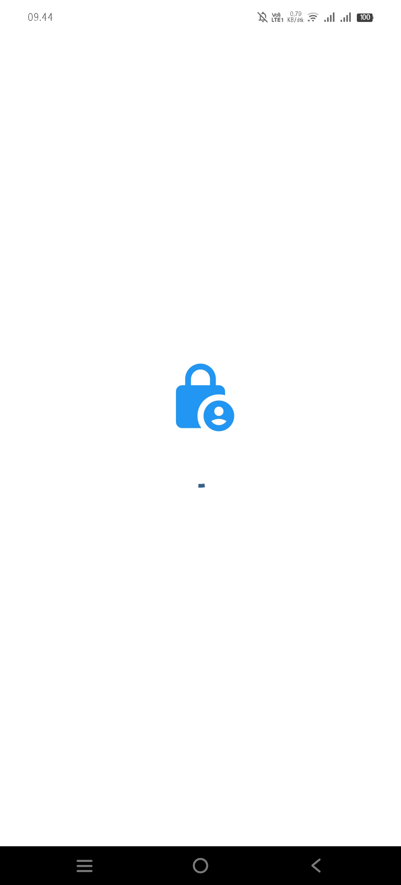 | 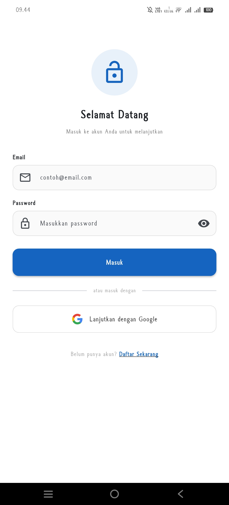 | 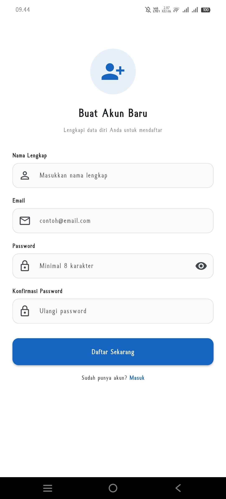 |

| Proses Verifikasi | Berhasil Login | Dashboard |
| ----------------- | -------------- | --------- |
| 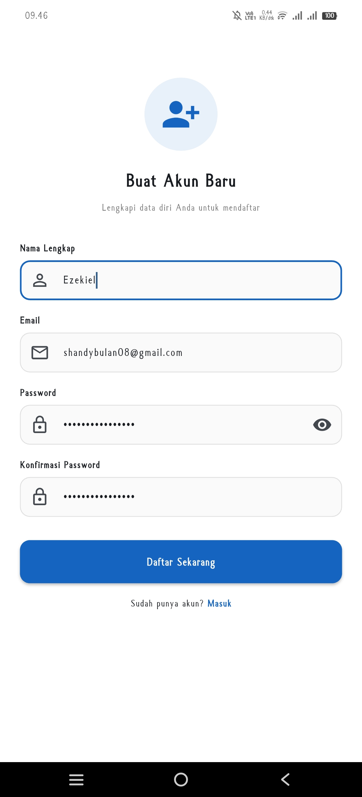 | 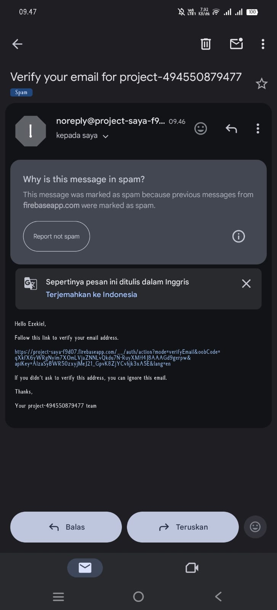 | 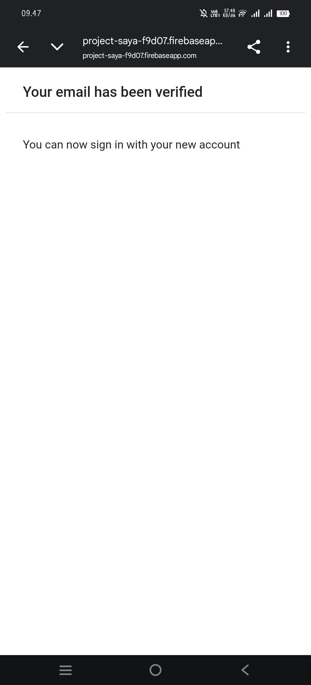 |

---

## 💻 Dashboard & Katalog Produk

Pada halaman utama pengguna dapat melihat seluruh daftar laptop yang diambil secara realtime melalui REST API Golang.

| Katalog Produk | Detail Produk | Detail Produk |
| -------------- | ------------- | ------------- |
| 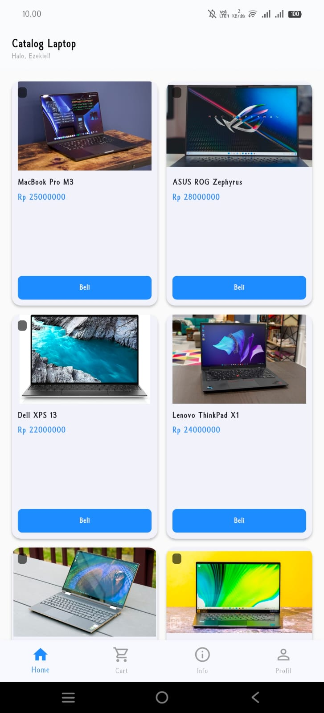 |  | 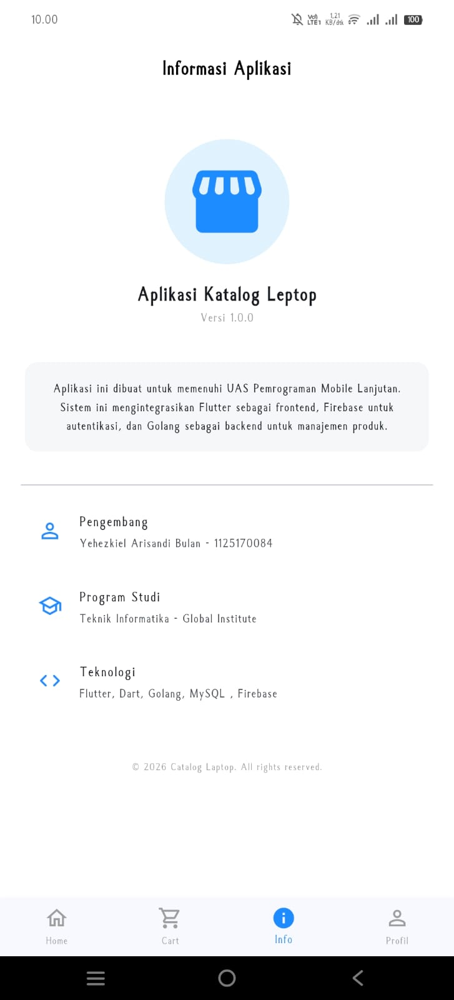 |

---

## 🛒 Keranjang Belanja

Pengguna dapat menambahkan produk ke dalam keranjang.

Fitur yang tersedia:

- Tambah Produk
- Hapus Produk
- Hitung Total Harga
- Local Notification


---

## 💳 Checkout

Proses pembayaran dilakukan setelah pengguna memilih produk.

Tahapan:

- Checkout
- Konfirmasi Pembayaran
- Ringkasan Pembayaran
- Pembayaran Berhasil

| Checkout | Pembayaran |
| --------- | ---------- |
| 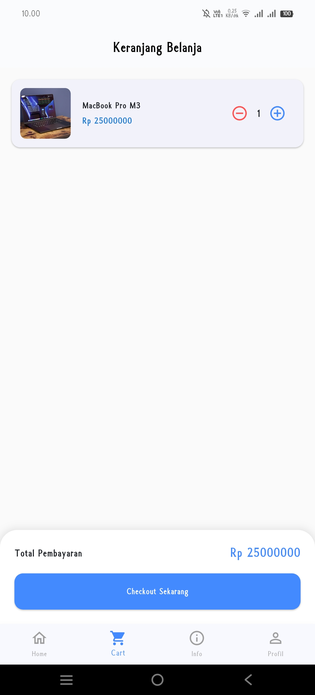 | 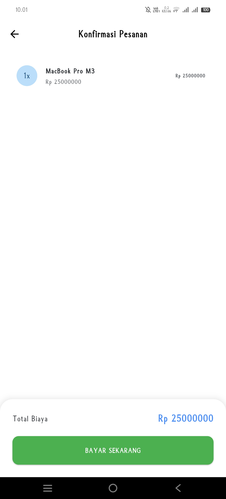 |

| Ringkasan | Selesai |
| ---------- | -------- |
| 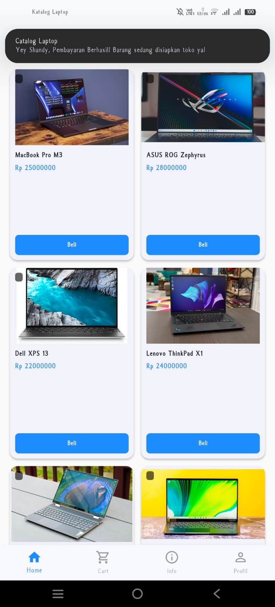 | 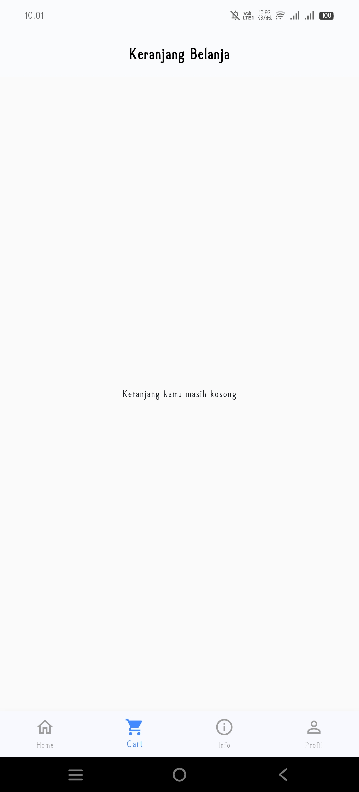 |

---

## 👤 Admin Panel (CRUD Produk)

Admin memiliki hak akses untuk mengelola data laptop.

Fitur Admin:

- Tambah Produk
- Edit Produk
- Hapus Produk

| Profile | Menu Admin | Tambah Produk |
| ------- | ---------- | ------------- |
| 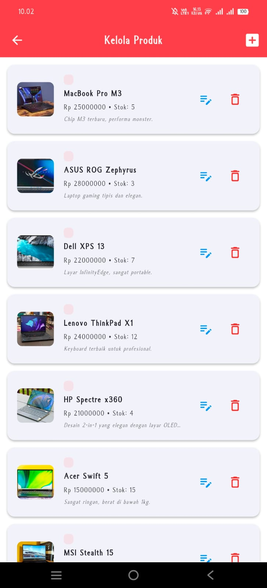 | 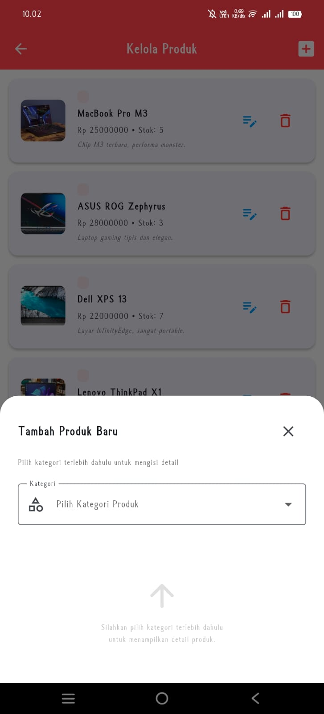 | 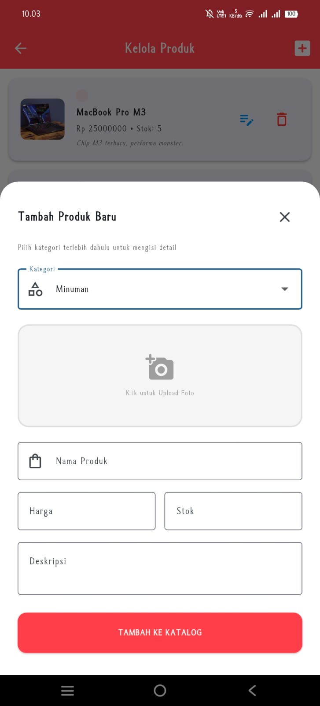 |

| Edit Produk | Hapus Produk |
| ------------ | ------------ |
| 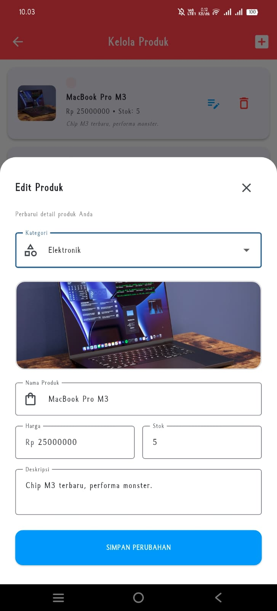 | 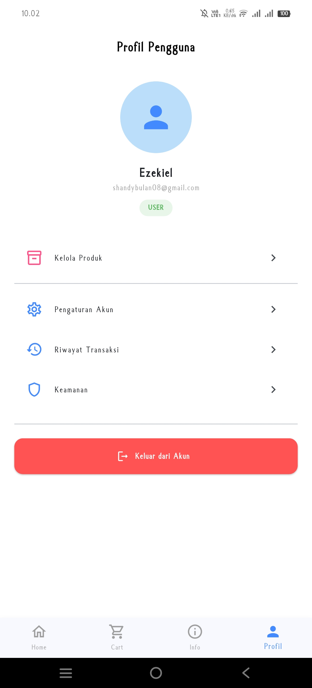 |

---

## 📂 Struktur Project

```text
lib/
│
├── models/
├── providers/
├── screens/
├── services/
├── widgets/
└── main.dart

backend/
│
├── controllers/
├── models/
├── routes/
├── database/
└── main.go
```

---

## 🛠 Cara Menjalankan Project

## Clone Project

```bash
git clone https://github.com/username/nama-project.git
```

Masuk ke Folder

```bash
cd nama-project
```

Install Dependency

```bash
flutter pub get
```

Jalankan Backend Golang

```bash
go run main.go
```

Jalankan Flutter

```bash
flutter run
```

---

## 📌 Requirement

- Flutter SDK 3.x
- Dart SDK
- Golang 1.22+
- MySQL
- Firebase Project
- Android Studio / VS Code

---

## 👨‍💻 Pengembang

### Yehezkiel Arisandi Bulan

NIM: **1125170084**

Teknik Informatika

Software Engineering

Universitas Global institute

---

## 📄 Lisensi

Project ini dibuat untuk memenuhi tugas **UAS Pemrograman Mobile Lanjutan**.
